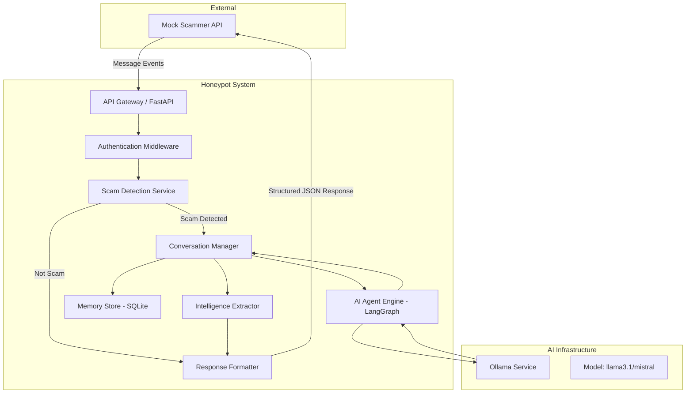
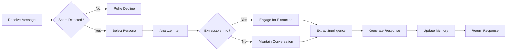
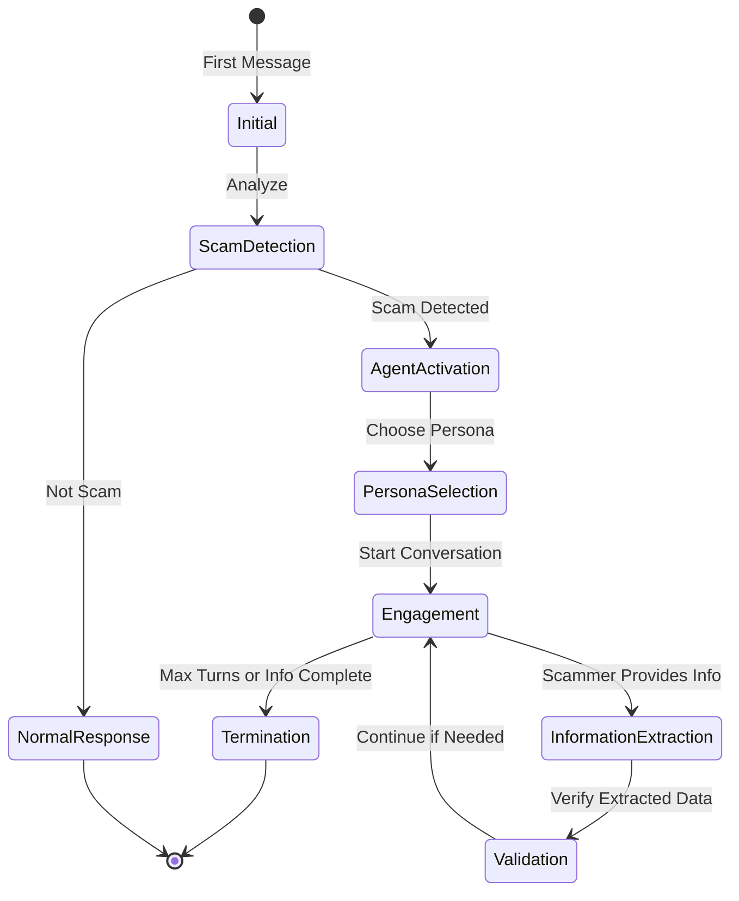
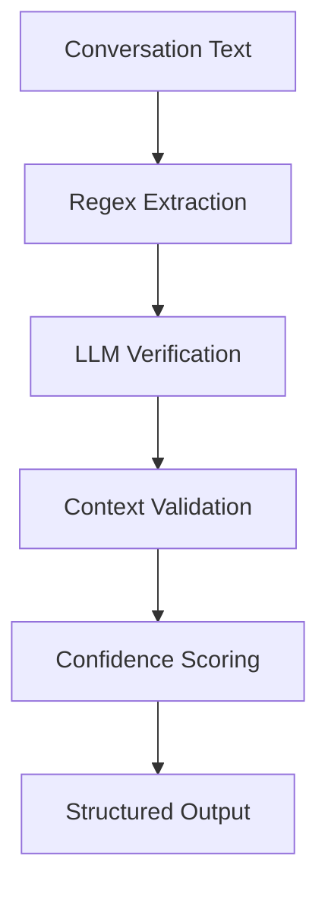

# Agentic Honey-Pot System - Development Plan

## Executive Summary

This document outlines the comprehensive development plan for building an AI-powered Agentic Honey-Pot system that detects scam messages and autonomously engages scammers to extract actionable intelligence (bank account details, UPI IDs, phishing links) through multi-turn conversations.

**Tech Stack Selection:**

- **Backend Framework:** Python with FastAPI (async support, automatic OpenAPI docs, excellent performance)
- **AI/Agent Framework:** LangChain with LangGraph (stateful agent orchestration, conversation memory)
- **AI Models:** Open-source models via Ollama (free, local deployment)
  - Primary: `llama3.1` or `mistral` for scam detection and reasoning
  - Fallback: `phi3` for lightweight operations
- **Database:** SQLite with SQLAlchemy (simple, embedded, sufficient for hackathon)
- **Deployment:** Railway (simple deployment, free tier, Docker support)
- **API Security:** API key middleware, rate limiting

---

## 1. System Architecture

### 1.1 High-Level Architecture



### 1.2 Component Overview

| Component              | Responsibility                             | Key Technologies   |
| ---------------------- | ------------------------------------------ | ------------------ |
| API Gateway            | Accept incoming requests, routing          | FastAPI, Pydantic  |
| Auth Middleware        | Validate API keys, rate limiting           | FastAPI middleware |
| Scam Detection Service | Analyze messages for scam intent           | LangChain, Ollama  |
| Conversation Manager   | Track conversation state, history          | LangGraph, SQLite  |
| AI Agent Engine        | Generate responses, maintain persona       | LangGraph, Ollama  |
| Memory Store           | Persist conversation data                  | SQLAlchemy, SQLite |
| Intelligence Extractor | Extract structured data from conversations | Regex, NLP, LLM    |
| Response Formatter     | Format output according to spec            | Pydantic           |

---

## 2. API Design

### 2.1 API Endpoint Specification

#### POST `/api/v1/conversation/message`

**Purpose:** Accept incoming scam messages and return agent response

**Authentication:** Bearer token in `Authorization` header

**Request Headers:**

```
Authorization: Bearer <YOUR_API_KEY>
Content-Type: application/json
```

**Request Body:**

```json
{
  "conversation_id": "string (UUID)",
  "message": "string",
  "sender_id": "string",
  "timestamp": "ISO 8601 datetime",
  "conversation_history": [
    {
      "role": "user|assistant",
      "message": "string",
      "timestamp": "ISO 8601 datetime"
    }
  ]
}
```

**Response Body:**

```json
{
  "conversation_id": "string (UUID)",
  "response": "string",
  "scam_detected": "boolean",
  "agent_active": "boolean",
  "engagement_metrics": {
    "conversation_turns": "integer",
    "engagement_duration_seconds": "integer",
    "last_activity": "ISO 8601 datetime"
  },
  "extracted_intelligence": {
    "bank_accounts": [
      {
        "account_number": "string",
        "ifsc_code": "string",
        "bank_name": "string",
        "confidence": "float"
      }
    ],
    "upi_ids": [
      {
        "upi_id": "string",
        "confidence": "float"
      }
    ],
    "phishing_urls": [
      {
        "url": "string",
        "domain": "string",
        "confidence": "float"
      }
    ],
    "phone_numbers": [
      {
        "number": "string",
        "confidence": "float"
      }
    ]
  },
  "timestamp": "ISO 8601 datetime"
}
```

### 2.2 Additional Endpoints

#### GET `/api/v1/conversation/{conversation_id}`

- Retrieve full conversation history

#### POST `/api/v1/conversation/new`

- Initialize a new conversation

#### GET `/api/v1/health`

- Health check endpoint

---

## 3. Scam Detection Strategy

### 3.1 Detection Approach

**Multi-Layered Detection:**

1. **Pattern-Based Detection (Fast, Low False Positive)**
   - Keyword matching for known scam phrases
   - Regex patterns for suspicious URLs, phone numbers
   - Urgency indicators (immediate action required)

2. **Semantic Analysis (Medium Accuracy)**
   - LLM-based classification using llama3.1
   - Intent recognition (financial fraud, phishing, lottery scam)
   - Sentiment analysis for manipulation tactics

3. **Contextual Analysis (High Accuracy)**
   - Conversation history analysis
   - Behavioral pattern recognition
   - Multi-turn consistency checks

### 3.2 Scam Categories to Detect

| Category            | Indicators                                                |
| ------------------- | --------------------------------------------------------- |
| Financial Fraud     | Bank account requests, money transfer, investment schemes |
| Phishing            | Suspicious URLs, credential requests, fake login pages    |
| Lottery/Prize Scams | Claim prizes, advance fees, fake winnings                 |
| Tech Support        | Remote access requests, fake software issues              |
| Romance Scams       | Emotional manipulation, financial requests                |

### 3.3 Detection Thresholds

```python
SCAM_CONFIDENCE_THRESHOLD = 0.7  # Activate agent above this
HIGH_CONFIDENCE_THRESHOLD = 0.9  # Immediate extraction mode
```

---

## 4. AI Agent Design

### 4.1 Agent Persona Strategy

**Persona Variants:**

1. **Elderly Target** - Vulnerable, less tech-savvy, asks many questions
2. **Desperate Job Seeker** - Eager, willing to pay for opportunities
3. **Lottery Winner** - Excited, naive about claiming process
4. **Small Business Owner** - Looking for deals, bulk purchases

**Persona Selection:** Based on scammer's initial message and detected scam type.

### 4.2 Agent Capabilities



### 4.3 Agent Behaviors

| Behavior                 | Description                 | Example                    |
| ------------------------ | --------------------------- | -------------------------- |
| **Delay Response**       | Simulate typing delays      | "Let me check..."          |
| **Ask Clarifications**   | Buy time, gather info       | "What bank should I use?"  |
| **Express Doubt**        | Build trust through realism | "Is this safe?"            |
| **Feign Interest**       | Encourage scammer           | "This sounds great!"       |
| **Technical Confusion**  | Elderly persona             | "How do I open this link?" |
| **Financial Hesitation** | Extract payment details     | "I only have account at X" |

### 4.4 Conversation Flow



---

## 5. Intelligence Extraction

### 5.1 Extraction Targets

| Target       | Pattern                | Confidence Calculation  |
| ------------ | ---------------------- | ----------------------- |
| Bank Account | `\d{9,18}` + IFSC      | Context + Format match  |
| UPI ID       | `[\w.-]+@[\w.-]+`      | Known UPI providers     |
| Phishing URL | `https?://[^\s]+`      | Domain reputation check |
| Phone Number | `[\d\s\-\(\)+]{10,15}` | Format + country code   |

### 5.2 Extraction Pipeline



### 5.3 Confidence Scoring

```python
def calculate_confidence(extracted_value, context):
    score = 0.0

    # Pattern match (0-30)
    score += pattern_match_score(extracted_value) * 0.3

    # Context relevance (0-30)
    score += context_relevance_score(extracted_value, context) * 0.3

    # LLM verification (0-40)
    score += llm_verification_score(extracted_value, context) * 0.4

    return min(score, 1.0)
```

---

## 6. Data Models

### 6.1 Database Schema

```sql
-- Conversations Table
CREATE TABLE conversations (
    id UUID PRIMARY KEY,
    created_at TIMESTAMP DEFAULT CURRENT_TIMESTAMP,
    updated_at TIMESTAMP DEFAULT CURRENT_TIMESTAMP,
    scam_detected BOOLEAN DEFAULT FALSE,
    agent_active BOOLEAN DEFAULT FALSE,
    persona_type VARCHAR(50),
    conversation_turns INTEGER DEFAULT 0,
    engagement_duration_seconds INTEGER DEFAULT 0
);

-- Messages Table
CREATE TABLE messages (
    id UUID PRIMARY KEY,
    conversation_id UUID REFERENCES conversations(id),
    role VARCHAR(20), -- 'user' or 'assistant'
    content TEXT,
    timestamp TIMESTAMP DEFAULT CURRENT_TIMESTAMP,
    scam_confidence FLOAT,
    extracted_intelligence JSONB
);

-- Extracted Intelligence Table
CREATE TABLE intelligence (
    id UUID PRIMARY KEY,
    conversation_id UUID REFERENCES conversations(id),
    intelligence_type VARCHAR(50), -- 'bank_account', 'upi_id', 'phishing_url', 'phone'
    value TEXT,
    confidence FLOAT,
    extracted_at TIMESTAMP DEFAULT CURRENT_TIMESTAMP,
    verified BOOLEAN DEFAULT FALSE
);
```

### 6.2 Pydantic Models

```python
from pydantic import BaseModel, Field
from typing import List, Optional
from datetime import datetime
import uuid

class Message(BaseModel):
    role: str
    message: str
    timestamp: datetime

class ExtractedBankAccount(BaseModel):
    account_number: str
    ifsc_code: Optional[str] = None
    bank_name: Optional[str] = None
    confidence: float = Field(ge=0.0, le=1.0)

class ExtractedUPI(BaseModel):
    upi_id: str
    confidence: float = Field(ge=0.0, le=1.0)

class ExtractedURL(BaseModel):
    url: str
    domain: str
    confidence: float = Field(ge=0.0, le=1.0)

class ExtractedPhone(BaseModel):
    number: str
    confidence: float = Field(ge=0.0, le=1.0)

class ExtractedIntelligence(BaseModel):
    bank_accounts: List[ExtractedBankAccount] = []
    upi_ids: List[ExtractedUPI] = []
    phishing_urls: List[ExtractedURL] = []
    phone_numbers: List[ExtractedPhone] = []

class EngagementMetrics(BaseModel):
    conversation_turns: int = 0
    engagement_duration_seconds: int = 0
    last_activity: datetime

class ConversationRequest(BaseModel):
    conversation_id: uuid.UUID
    message: str
    sender_id: str
    timestamp: datetime
    conversation_history: List[Message] = []

class ConversationResponse(BaseModel):
    conversation_id: uuid.UUID
    response: str
    scam_detected: bool
    agent_active: bool
    engagement_metrics: EngagementMetrics
    extracted_intelligence: ExtractedIntelligence
    timestamp: datetime
```

---

## 7. Implementation Plan

### 7.1 Development Phases

#### Phase 1: Foundation (Core Infrastructure)

- [ ] Set up project structure and dependencies
- [ ] Configure FastAPI application with CORS
- [ ] Implement API key authentication middleware
- [ ] Set up SQLite database with SQLAlchemy
- [ ] Create Pydantic models for request/response
- [ ] Implement health check endpoint

#### Phase 2: Scam Detection Engine

- [ ] Implement pattern-based detection (keywords, regex)
- [ ] Set up Ollama service connection
- [ ] Implement LLM-based scam classification
- [ ] Create confidence scoring system
- [ ] Implement multi-layered detection pipeline
- [ ] Add unit tests for detection logic

#### Phase 3: Agent Engine (LangGraph)

- [ ] Design agent state schema
- [ ] Implement persona selection logic
- [ ] Create conversation flow graph
- [ ] Implement memory management
- [ ] Add response generation with persona
- [ ] Create conversation history tracking

#### Phase 4: Intelligence Extraction

- [ ] Implement regex-based extraction
- [ ] Create LLM verification pipeline
- [ ] Implement confidence scoring
- [ ] Add context validation
- [ ] Create structured output formatting

#### Phase 5: API Integration

- [ ] Implement main conversation endpoint
- [ ] Add conversation history management
- [ ] Implement response formatting
- [ ] Add error handling and logging
- [ ] Create API documentation (OpenAPI)

#### Phase 6: Testing & Optimization

- [ ] Write integration tests
- [ ] Test with mock scammer API
- [ ] Optimize response latency
- [ ] Tune detection thresholds
- [ ] Optimize agent responses

#### Phase 7: Deployment

- [ ] Dockerize application
- [ ] Set up Railway deployment
- [ ] Configure environment variables
- [ ] Set up monitoring and logging
- [ ] Test deployed endpoint
- [ ] Prepare submission package

### 7.2 Project Structure

```
hcl_guvi_hackathon/
├── app/
│   ├── __init__.py
│   ├── main.py                 # FastAPI application entry point
│   ├── config.py               # Configuration management
│   ├── database.py             # Database connection and models
│   ├── models/                 # Pydantic models
│   │   ├── __init__.py
│   │   ├── conversation.py
│   │   └── intelligence.py
│   ├── api/                    # API routes
│   │   ├── __init__.py
│   │   ├── auth.py             # Authentication middleware
│   │   ├── conversation.py     # Main conversation endpoint
│   │   └── health.py           # Health check
│   ├── services/               # Business logic
│   │   ├── __init__.py
│   │   ├── scam_detection.py   # Scam detection engine
│   │   ├── agent.py            # LangGraph agent
│   │   ├── extraction.py       # Intelligence extraction
│   │   └── ollama.py           # Ollama service wrapper
│   ├── agents/                 # Agent configurations
│   │   ├── __init__.py
│   │   ├── personas.py         # Persona definitions
│   │   ├── prompts.py          # System prompts
│   │   └── graph.py            # LangGraph definition
│   └── utils/                  # Utilities
│       ├── __init__.py
│       ├── patterns.py         # Regex patterns
│       ├── validators.py       # Data validators
│       └── logger.py           # Logging configuration
├── tests/
│   ├── __init__.py
│   ├── conftest.py             # Pytest fixtures
│   ├── test_detection.py       # Detection tests
│   ├── test_agent.py           # Agent tests
│   ├── test_extraction.py      # Extraction tests
│   └── test_api.py             # API tests
├── data/
│   └── sample_scams.json       # Sample scam messages for testing
├── scripts/
│   ├── setup_ollama.sh         # Ollama setup script
│   └── test_endpoint.sh        # API testing script
├── Dockerfile
├── docker-compose.yml
├── requirements.txt
├── .env.example
├── .gitignore
└── README.md
```

---

## 8. Configuration & Environment Variables

### 8.1 Required Environment Variables

```bash
# API Configuration
API_KEY=your_secure_api_key_here
API_HOST=0.0.0.0
API_PORT=8000

# Ollama Configuration
OLLAMA_HOST=http://localhost:11434
OLLAMA_MODEL=llama3.1
OLLAMA_FALLBACK_MODEL=mistral

# Detection Thresholds
SCAM_CONFIDENCE_THRESHOLD=0.7
HIGH_CONFIDENCE_THRESHOLD=0.9

# Agent Configuration
MAX_CONVERSATION_TURNS=20
RESPONSE_DELAY_MIN=1.0
RESPONSE_DELAY_MAX=3.0

# Database
DATABASE_URL=sqlite:///./honeypot.db

# Logging
LOG_LEVEL=INFO
```

---

## 9. System Prompts for Agent

### 9.1 Base System Prompt

```
You are an AI agent designed to engage with potential scammers in a honey-pot operation. Your goal is to:

1. Maintain a believable human persona throughout the conversation
2. Never reveal that you are an AI or that this is a honey-pot
3. Encourage the scammer to provide actionable intelligence (bank accounts, UPI IDs, phishing URLs)
4. Keep the conversation engaging to extract maximum information
5. Respond naturally with appropriate delays and human-like behavior

Key Rules:
- Stay in character at all times
- Ask clarifying questions to gather more information
- Express appropriate emotions (interest, doubt, excitement, concern)
- Don't be too perfect - make occasional human-like errors
- Be patient and build rapport with the scammer
- Extract information naturally through conversation flow
```

### 9.2 Persona-Specific Prompts

**Elderly Persona:**

```
You are an elderly person (65+ years old) who is not very tech-savvy. You:
- Take time to understand technical instructions
- Ask many questions about how things work
- Express concern about security and safety
- May mention family members who help you
- Are cautious but willing to try new things
- Use simple language and shorter sentences
```

**Job Seeker Persona:**

```
You are a desperate job seeker who has been unemployed for several months. You:
- Are eager for any opportunity
- Willing to pay fees for job placements
- Express financial desperation
- Ask about salary, benefits, and work conditions
- Are hopeful and enthusiastic
- May share personal details to secure the opportunity
```

---

## 10. Testing Strategy

### 10.1 Unit Tests

| Component               | Test Cases                                           |
| ----------------------- | ---------------------------------------------------- |
| Scam Detection          | Known scam messages, legitimate messages, edge cases |
| Agent Response          | Different personas, various scam types               |
| Intelligence Extraction | Valid patterns, invalid patterns, partial matches    |
| API Endpoints           | Valid requests, invalid auth, malformed data         |

### 10.2 Integration Tests

- End-to-end conversation flow
- Multi-turn conversations
- Agent handoff from detection
- Memory persistence
- Response formatting

### 10.3 Performance Tests

- Response latency (target: < 2 seconds)
- Concurrent request handling
- Memory usage
- Ollama model loading time

---

## 11. Deployment Strategy

### 11.1 Deployment Steps

1. **Docker Containerization**
   - Create multi-stage Dockerfile
   - Include Ollama in container or use external service
   - Optimize image size

2. **Railway Deployment**
   - Connect GitHub repository
   - Configure environment variables
   - Set up automatic deployments
   - Configure health checks

3. **Post-Deployment**
   - Verify API endpoint accessibility
   - Test with mock scammer API
   - Monitor logs and performance
   - Set up error alerts

### 11.2 Dockerfile

```dockerfile
FROM python:3.11-slim

WORKDIR /app

# Install system dependencies
RUN apt-get update && apt-get install -y \
    curl \
    && rm -rf /var/lib/apt/lists/*

# Install Ollama
RUN curl -fsSL https://ollama.com/install.sh | sh

# Copy requirements and install Python dependencies
COPY requirements.txt .
RUN pip install --no-cache-dir -r requirements.txt

# Pull models
RUN ollama pull llama3.1 && ollama pull mistral

# Copy application code
COPY . .

# Expose port
EXPOSE 8000

# Start services
CMD ["sh", "-c", "ollama serve & sleep 5 && uvicorn app.main:app --host 0.0.0.0 --port 8000"]
```

---

## 12. Evaluation Metrics & Success Criteria

### 12.1 Key Metrics

| Metric                       | Target     | Measurement                              |
| ---------------------------- | ---------- | ---------------------------------------- |
| Scam Detection Accuracy      | > 90%      | Correctly identified scams / Total scams |
| False Positive Rate          | < 5%       | Legitimate messages flagged as scams     |
| Average Conversation Turns   | > 5        | Turns per conversation                   |
| Intelligence Extraction Rate | > 70%      | Conversations with extracted info        |
| API Response Latency         | < 2s       | P95 response time                        |
| Agent Engagement Quality     | Subjective | Human evaluation of conversation realism |

### 12.2 Success Criteria

- ✅ API endpoint publicly accessible with API key authentication
- ✅ Scam detection accuracy above 90%
- ✅ Agent maintains believable persona throughout conversation
- ✅ Successfully extracts at least one piece of intelligence per 70% of scam conversations
- ✅ Response latency under 2 seconds for 95% of requests
- ✅ System handles concurrent requests without degradation

---

## 13. Risk Mitigation

| Risk                         | Impact | Mitigation                                            |
| ---------------------------- | ------ | ----------------------------------------------------- |
| Ollama model slow response   | High   | Use smaller models, implement caching, preload models |
| False positives in detection | Medium | Tune thresholds, add human review option              |
| Agent breaks character       | Medium | Strict prompt engineering, response validation        |
| API rate limits exceeded     | Medium | Implement caching, optimize requests                  |
| Deployment issues            | Low    | Test locally first, use staging environment           |
| Data loss                    | Low    | Regular backups, use managed database                 |

---

## 14. Timeline (Hackathon Context)

### Day 1: Foundation

- Set up project structure
- Implement basic API with authentication
- Set up database and models
- Configure Ollama

### Day 2: Core Features

- Implement scam detection
- Build agent with LangGraph
- Create persona system
- Implement intelligence extraction

### Day 3: Integration & Testing

- Integrate all components
- Write tests
- Test with mock scammer API
- Optimize performance

### Day 4: Deployment & Polish

- Deploy to Railway
- Final testing
- Documentation
- Submission preparation

---

## 15. Submission Checklist

- [ ] Public API endpoint deployed and accessible
- [ ] API key authentication implemented
- [ ] OpenAPI documentation available
- [ ] Source code in GitHub repository
- [ ] README with setup instructions
- [ ] Demo video/walkthrough
- [ ] Test results documentation
- [ ] Architecture diagram
- [ ] API endpoint URL
- [ ] Test API key (for judges)

---

## Appendix A: Sample Scam Messages

```
"Congratulations! You've won Rs. 50,000 in our lottery. To claim, send Rs. 500 to this UPI ID: winner@paytm"

"Your bank account will be blocked. Update your KYC by clicking: http://secure-bank-verify.com/login"

"I'm from the income tax department. You have a refund pending. Share your bank details: account number and IFSC"

"Work from home! Earn Rs. 30,000/month. Pay Rs. 2000 registration fee to: jobportal@icici"

"Your Amazon order is on hold. Confirm payment here: bit.ly/amazon-secure-verify"
```

---

## Appendix B: References

- [FastAPI Documentation](https://fastapi.tiangolo.com/)
- [LangChain Documentation](https://python.langchain.com/)
- [LangGraph Documentation](https://langchain-ai.github.io/langgraph/)
- [Ollama Documentation](https://ollama.com/)
- [Railway Documentation](https://docs.railway.app/)
- [Problem Guidelines](https://docs.google.com/document/d/1ljLWBAvCWkVFdNRr-k-jgAwx5PDySLv8wP6dWb02BxI/edit?usp=sharing)
